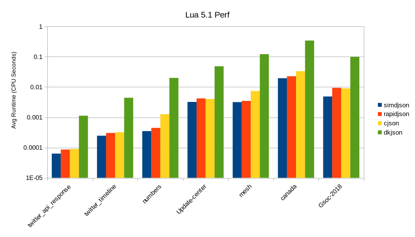
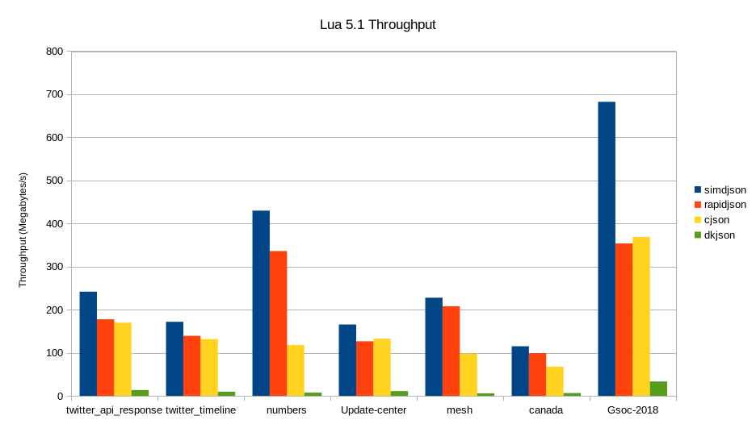

# lua-simdjson
[](https://github.com/FourierTransformer/lua-simdjson/actions?query=branch%3Amaster)

A basic Lua binding to [simdjson](https://simdjson.org). The simdjson library is an incredibly fast JSON parser that uses SIMD instructions and fancy algorithms to parse JSON very quickly. It's been tested with LuaJIT 2.0/2.1 and Lua 5.1, 5.2, 5.3, and 5.4 on linux/osx/windows. It has a general parsing mode and a lazy mode that uses a JSON pointer.

Current simdjson version: 4.0.7

## Installation
If all the requirements are met, lua-simdjson can be install via luarocks with:

```
luarocks install lua-simdjson
```
Otherwise it can be installed manually by pulling the repo and running luarocks make.

## Requirements
 * lua-simdjson only works on 64bit systems.
 * a Lua build environment with support for C++11
   * g++ version 7+ and clang++ version 6+ or newer should work!

## Parsing
There are two main ways to parse JSON in lua-simdjson:
 1. With `parse`: this parses JSON and returns a Lua table with the parsed values
 2. With `open`: this reads in the JSON and keeps it in simdjson's internal format. The values can then be accessed using a JSON pointer (examples below)

Both of these methods also have support to read files on disc with `parseFile` and `openFile` respectively. If handling JSON from disk, these methods should be used and are incredibly fast.

## Typing
* lua-simdjson uses `simdjson.null` to represent `null` values from parsed JSON.
  * Any application should use that for comparison as needed.
* it uses `lua_pushnumber` and `lua_pushinteger` for JSON floats and ints respectively, so your Lua version may handle that slightly differently.
  * `lua_pushinteger` uses signed ints. A number from JSON larger than `LUA_MAXINTEGER` will be represented as a float/number
* All other types map as expected.

### Parse some JSON
The `parse` methods will return a normal Lua table that can be interacted with.
```lua
local simdjson = require("simdjson")
local response = simdjson.parse([[
{
    "Image": {
        "Width":  800,
        "Height": 600,
        "Title":  "View from 15th Floor",
        "Thumbnail": {
            "Url":    "http://www.example.com/image/481989943",
            "Height": 125,
            "Width":  100
        },
        "Animated" : false,
        "IDs": [116, 943, 234, 38793]
    }
}
]])
print(response["Image"]["Width"])

-- OR to parse a file from disk
local fileResponse = simdjson.parseFile("jsonexamples/twitter.json")
print(fileResponse["statuses"][1]["id"])

```

### Open some json
The `open` methods currently require the use of a JSON pointer, but are very quick. They are best used when you only need a part of a response. In the example below, it could be useful for just getting the `Thumnail` object with `:atPointer("/Image/Thumbnail")` which will then only create a Lua table with those specific values.
```lua
local simdjson = require("simdjson")
local response = simdjson.open([[
{
    "Image": {
        "Width":  800,
        "Height": 600,
        "Title":  "View from 15th Floor",
        "Thumbnail": {
            "Url":    "http://www.example.com/image/481989943",
            "Height": 125,
            "Width":  100
        },
        "Animated" : false,
        "IDs": [116, 943, 234, 38793]
    }
}
]])
print(response:atPointer("/Image/Width"))

-- OR to parse a file from disk
local fileResponse = simdjson.openFile("jsonexamples/twitter.json")
print(fileResponse:atPointer("/statuses/0/id")) --using a JSON pointer

```
Starting with version 0.2.0, the `atPointer` method is JSON pointer compliant. The previous pointer implementation is considered deprecated, but is still available with the `at` method.

The `open` and `parse` codeblocks should print out the same values. It's worth noting that the JSON pointer indexes from 0.

This lazy style of using the simdjson data structure could also be used with array access in the future.

## Error Handling
lua-simdjson will error out with any errors from simdjson encountered while parsing. They are very good at helping identify what has gone wrong during parsing.

## Benchmarks
I ran some benchmarks against lua-cjson, rapidjson, and dkjson. For each test, I loaded the JSON into memory, and then had the parsers go through each file 100 times and took the average time it took to parse to a Lua table. You can see all the results in the [benchmark](benchmark/) folder. I've included a sample output run via Lua (the LuaJIT graph looks very similar, also in the benchmark folder). The y-axis is logarithmic, so every half step down is twice as fast.



I also calculated the throughput for each of the files to show how it may affect real-world performance. You can also find a LuaJIT version in the benchmarks folder



All tested files are in the [jsonexamples folder](jsonexamples/).

lua-simdjson, like the simdjson library performs better on more modern hardware. These benchmarks were run on a ninth-gen i7 processor. On an older processor, rapidjson may perform better.

## Caveats & Alternatives
 * there is no encoding/dumping a Lua table to JSON (yet! Most other lua JSON libraries can handle this)
 * it only works on 64 bit systems
 * it builds a large binary. On a modern linux system, it ended up being \~200k (lua-cjson comes in at 42k)
 * since it's an external module, it's not quite as easy to just grab the file and go (dkjson has you covered here!)

## Philosophy
I plan to keep it fairly inline with what the original simdjson library is capable of doing, which really means not adding too many additional options. The big _thing_ that's missing so far is encoding a lua table to JSON. I may add in an encoder at some point.

## Licenses
 * The jsonexamples, src/simdjson.cpp, src/simdjson.h are unmodified from the released version simdjson under the Apache License 2.0.
 * All other files/folders are apart of lua-simdjson also under the Apache License 2.0.
